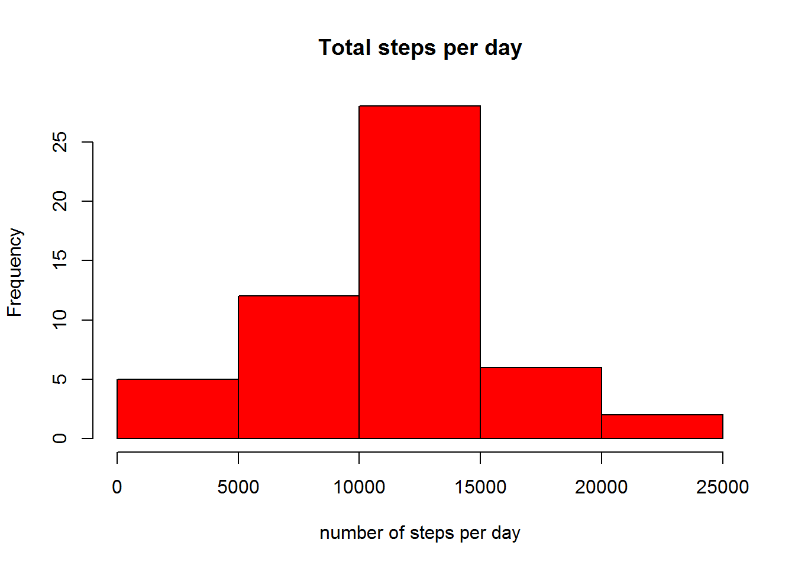
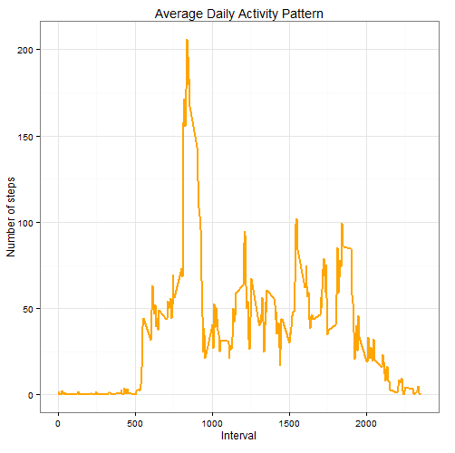
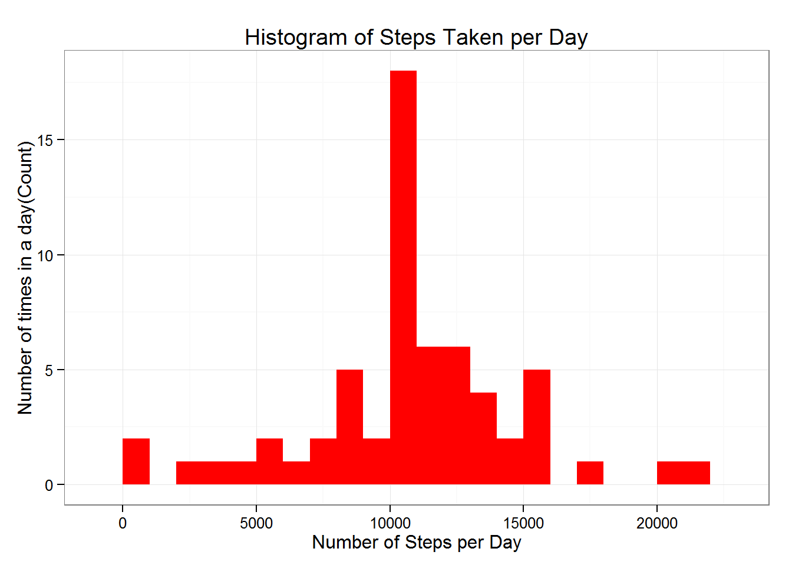
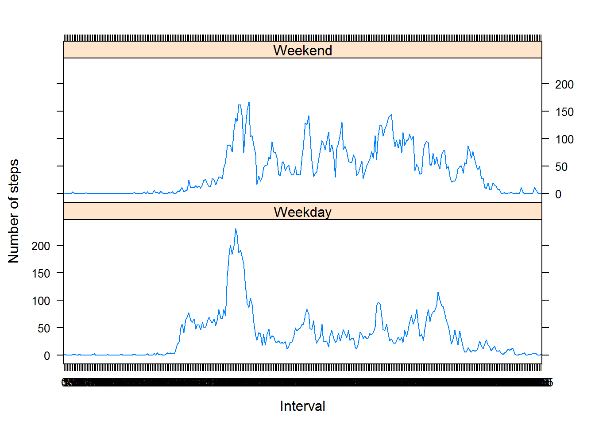

# Reproducible Research: Peer assessment 1
### *15 Nov 2015*

==============================================================

## Introduction

This document presents the results of peer assessments 1 of course [Reproducible Research](https://class.coursera.org/repdata-004) on [coursera](https://www.coursera.org).   

## Preparing the R environment

 

First, we set echo equal a **TRUE** and results equal a **'hold'** as global options for this document.  
```{r set_options}
library(knitr)
opts_chunk$set(echo = TRUE, results = 'hold')
```

### Load required libraries
```{r call_libraries}
library(lattice)
library(ggplot2) # we may use ggplot2 for plotting figures
```


## Loading and preprocessing the data

This assignment makes use of data from a personal activity monitoring device. This device collects data at 5 minute intervals through out the day. The data consists of two months of data from an anonymous individual collected during the months of October and November, 2012 and include the number of steps taken in 5 minute intervals each day.  

This assignment instructions request to show any code that is needed to loading and preprocessing the data, like to:  

1. Load the data (i.e. > <font color='red'>read.csv()</font>)  
2. Process/transform the data (if necessary) into a format suitable for your analysis

### Load the required data

`read.csv()` was used to load the data.

**Note**: It is assumed that the file activity.csv is in the current working directory. File can be downloaded from [here](https://d396qusza40orc.cloudfront.net/repdata%2Fdata%2Factivity.zip)

```{r read_data}
df=read.csv('c:/ch1/rf/rep/activity.csv',sep=',',stringsAsFactors=FALSE)
```

### Process/transform the data  into a format suitable for our analysis

We convert the **date** field to `Date` class and **interval** field to `Factor` class.

```{r tidy_data}
df$date=as.Date(df$date,"%Y-%m-%d")
df$interval=as.factor(df$interval)
```


## What is mean total number of steps taken per day?

Now here we ignore the missing values(*a valid assumption*).

using aggregate function to calculate the total steps per day.

```{r pre_calc_stepsperday}
dailySteps=aggregate(steps~date,df,sum,na.rm=TRUE)
```

1. The Histogram is:

```{r histo}
hist(dailySteps$steps,main = 'Total steps per day',xlab = 'number of steps per day',col = 'red')

```

2.  and the ***mean*** and ***median*** are:

```{r meanmedian}
meanStep=mean(dailySteps$steps,na.rm = TRUE) #meanStep=10766.19
medianStep=median(dailySteps$steps,na.rm = TRUE)#medianStep=10765
```


## What is the average daily activity pattern?

 aggregation of steps by intervals of 5-minutes and calculating the mean and saving it in  `intervalSteps`.

```{r steps_interval}
intervalSteps=aggregate(steps~interval,df,mean,na.rm=TRUE)
names(intervalSteps)=c('Interval','mean')
```


1.The plot is:


```{r plot_time_series}
ggplot(intervalSteps, aes(x = Interval,y=mean)) + 
  geom_line(color = "orange",size = 1) + 
  labs(title="Time-series of the average number of steps per intervals", 
       x = "interval", y = "Average Number of steps") + theme_bw()
```


2. Which 5-minute interval, on average across all the days in the dataset, contains the maximum number of steps?

```{r max_interval}
maxIntval=intervalSteps[intervalSteps$mean==max(intervalSteps$mean,na.rm = FALSE),]
#    Interval     mean
#104      835 206.1698
```


## Imputing missing values:

### 1. Total number of missing values:

Total number of NA's

```{r tot_na_value}

sum(is.na(df$steps))
#2304

```


### 2. Strategy for filling in all of the missing values in the dataset

Replace missing values by the mean of their corresponding interval.

```{r fill_na}
fillNA <- numeric()
for (i in 1:nrow(df)) {
  obs <- df[i, ]
  if (is.na(obs$steps)) {
    steps <- subset(intervalSteps, Interval == obs$interval)$mean
  } else {
    steps <- obs$steps
  }
  fillNA <- c(fillNA, steps)
}
```

Creating a new dataset with no missing value

```{r check_empty}
newdf<- df
newdf$steps <- fillNA
```


### 3. A histogram of the total number of steps taken each day

Make a histogram of the total number of steps taken each day and Calculate and report the mean and median total number of steps taken per day. Do these values differ from the estimates from the first part of the assignment? What is the impact of imputing missing data on the estimates of the total daily number of steps?


```{r histo_fill}
dailySteps2 <- aggregate(steps ~ date, data = newdf, sum, na.rm = TRUE)
ggplot(dailySteps2, aes(x = steps)) + 
  geom_histogram(fill = "red", binwidth = 1000) + 
  labs(title="Histogram of Steps Taken per Day", 
       x = "Number of Steps per Day", y = "Number of times in a day(Count)") + theme_bw() 

```


### Calculate and report the **mean** and **median** total number of steps taken per day.

```{r meanmedian_fill}
meanStep2=mean(dailySteps2$steps,na.rm = TRUE)#mean:10766.19
medianStep2=median(dailySteps2$steps,na.rm = TRUE)#median:10766.19
```


### Do these values differ from the estimates from the first part of the assignment?

Yes, After replacing the mean is the same but the median is a little bit different.after filling the data mean and median are equal.
    

### What is the impact of imputing missing data on the estimates of the total daily number of steps?

As you can see, comparing with the calculations done in the first section of this document, we observe that while the mean value remains unchanged, the median value has shifted and virtual matches to the mean.  

Since our data has shown a t-student distribution (see both histograms), it seems that the impact of imputing missing values has increase our peak, but it's not affect negatively our predictions. 


## Are there differences in activity patterns between weekdays and weekends?

For this part the weekdays() function may be of some help here. Use the dataset with the filled-in missing values for this part.

Create a new factor variable in the dataset with two levels – “weekday” and “weekend” indicating whether a given date is a weekday or weekend day.

```{r weekdays}
day <- weekdays(newdf$date)
daylevel <- vector()
for (i in 1:nrow(newdf)) {
  if (day[i] == "Saturday") {
    daylevel[i] <- "Weekend"
  } else if (day[i] == "Sunday") {
    daylevel[i] <- "Weekend"
  } else {
    daylevel[i] <- "Weekday"
  }
}
newdf$daylevel <- daylevel
newdf$daylevel <- factor(newdf$daylevel)

stepsByDay <- aggregate(steps ~ interval + daylevel, data = newdf, mean)
names(stepsByDay) <- c("interval", "daylevel", "steps")
```

The panel plot is:
```{r plot_weekdays}
xyplot(steps ~ interval | daylevel, stepsByDay, type = "l", layout = c(1, 2), 
       xlab = "Interval", ylab = "Number of steps")

```

We can see that between intervals 1000 and 2000 we have higher number of steps in weekend. But the peak of steps number in weekdays is more than weekends.

